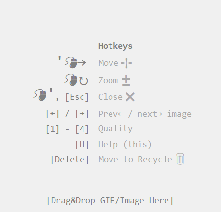

# Gifer

Gifer is a gif & image viewer (.gif, .bmp, .jp[e]g, .png) for Windows.

Download: https://github.com/ewgraf/gifer/releases/tag/v1

Features: borderless, draggable, drag&drop, standalone - no installation required

Functuanality: https://youtu.be/zL0Q6VszwBA (please turn on subtitles {hotkey [C]} to see description)

Requirements: Windows Vista?/7/8/10 x64, [.Net Framework 4.5+](https://www.microsoft.com/ru-ru/download/details.aspx?id=30653)

If you've met any trouble with gifer.exe, please feel free to contact me ewgraf@mail.ru. I would be glad to help you, an investigation of user experience is the point.

horo.gif (lena.bmp)

# Debug
Если при дебаге в Visual Studio картинка не перетаскивается Drag&Drop'ом на форму, то нужно запустить студию не от админа а от локального пользователя, т.к. файловая система, из которой перетаскивается файл должна иметь те же права доступа что и программа, либо билдить проект и запускать программу из релиза пользователем, такие дела.

If while Debug the Drag&Drom feature is not working - the cursor is turned into crossed-circle - try to re-run VS as USER, NOT AS ADMIN, as explorer.exe should have same "access level" as gifer.exe, to succeed drug&drop.
